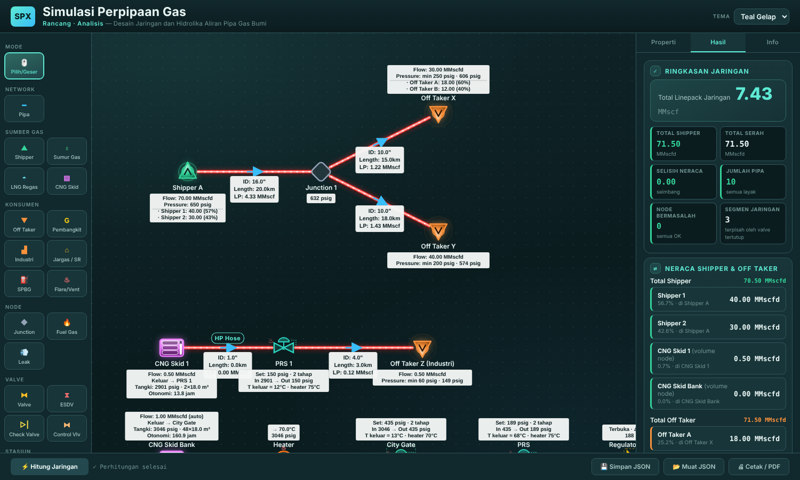

# Simulasi Perpipaan Gas

Aplikasi web satu-file untuk **merancang jaringan pipa gas bumi dan menghitung hidrolikanya** langsung di browser: gambar jaringan di kanvas, isi properti tiap peralatan, tekan *Hitung Jaringan*, lalu baca tekanan, laju alir, dan linepack di setiap titik.

Tidak perlu instalasi, server, atau koneksi internet — cukup satu file `Simulasi_Perpipaan_Gas.html`.



> **Untuk pelatihan dan studi awal.** Koefisien dan korelasi yang dipakai adalah pendekatan rekayasa. Aplikasi ini bukan pengganti perangkat desain bersertifikat maupun perhitungan serah-terima fiskal (custody transfer).

---

## Daftar Isi

1. [Memulai](#1-memulai)
2. [Mengenal Tampilan](#2-mengenal-tampilan)
3. [Alur Kerja Dasar](#3-alur-kerja-dasar)
4. [Menu Toolbar dan Equipment](#4-menu-toolbar-dan-equipment)
5. [Properti Tiap Elemen](#5-properti-tiap-elemen)
6. [Pengaturan Jaringan: Satuan, Persamaan Aliran, Gas](#6-pengaturan-jaringan)
7. [Fitur Otomatis](#7-fitur-otomatis)
8. [Membaca Hasil](#8-membaca-hasil)
9. [Simpan, Muat, Cetak](#9-simpan-muat-cetak)
10. [Contoh Jaringan Bawaan](#10-contoh-jaringan-bawaan)
11. [Batasan](#11-batasan)
12. [Pemecahan Masalah](#12-pemecahan-masalah)
13. [Kustomisasi](#13-kustomisasi)

---

## 1. Memulai

### Menjalankan

| Cara | Langkah |
|---|---|
| **Lokal** | Unduh `Simulasi_Perpipaan_Gas.html`, lalu klik dua kali untuk membukanya di browser. |
| **GitHub Pages** | Di repositori: *Settings → Pages → Deploy from a branch*, pilih branch `main`. Aplikasi tersedia di `https://<username>.github.io/<repo>/Simulasi_Perpipaan_Gas.html`. Ganti nama file menjadi `index.html` bila ingin alamat tanpa nama file. |

Disarankan memakai Chrome, Edge, atau Firefox versi terbaru pada layar desktop/laptop. Interaksi kanvas memakai mouse, sehingga tidak dirancang untuk layar sentuh.

### Kode akses

Saat dibuka, aplikasi meminta kode akses:

```
admin 123
```

Kode cukup dimasukkan sekali per sesi browser (tab ditutup = diminta lagi).

> **Catatan keamanan.** Gerbang ini hanya penghalang ringan. Kode tersimpan sebagai teks di dalam file HTML, sehingga siapa pun yang membuka *source* di repositori publik dapat membacanya. Jangan mengandalkannya untuk melindungi data rahasia.

---

## 2. Mengenal Tampilan

| Area | Letak | Fungsi |
|---|---|---|
| **Header** | Atas | Judul aplikasi dan pemilih **TEMA** (Teal Gelap, Biru Navy, Grafit, Marun). |
| **Toolbar** | Kiri | Mode kerja, tombol pipa, seluruh equipment (dikelompokkan per menu), serta Hapus dan Bersihkan. |
| **Kanvas** | Tengah | Tempat menggambar jaringan. Bisa digulir bila jaringan lebih besar dari layar. |
| **Panel samping** | Kanan | Tiga tab: **Properti**, **Hasil**, **Info**. |
| **Bilah bawah** | Bawah | Tombol **⚡ Hitung Jaringan**, status perhitungan, Simpan/Muat JSON, Cetak/PDF. |

### Tiga tab panel samping

- **Properti** — bila tidak ada yang dipilih: pengaturan jaringan (satuan, persamaan aliran, properti gas). Bila sebuah node atau pipa dipilih: properti elemen itu.
- **Hasil** — ringkasan jaringan, neraca shipper/off taker, aliran tiap pipa, hasil tiap peralatan, dan daftar masalah.
- **Info** — panduan di dalam aplikasi: cara pakai, legenda simbol, penjelasan CNG Skid, PRS, EOS, template gas, dan batasan solver.

---

## 3. Alur Kerja Dasar

1. **Tambah node.** Klik tombol equipment di toolbar, lalu klik area kosong di kanvas. Setelah satu node ditempatkan, mode kembali ke *Pilih/Geser* — klik tombol lagi untuk menambah node berikutnya.
2. **Sambungkan dengan pipa.** Klik **━ Pipa**, klik node pertama, lalu node kedua. Pipa muncul dengan nilai awal (ID 12 inch, panjang 10 km) yang dapat diubah.
3. **Isi properti.** Klik node atau pipa; isi datanya di tab **Properti**.
4. **Atur gas dan persamaan aliran.** Klik area kosong kanvas agar tidak ada elemen terpilih, lalu atur di tab **Properti**.
5. **Hitung.** Klik **⚡ Hitung Jaringan**. Bila ada data wajib yang kosong, jendela validasi menunjukkan apa yang perlu diperbaiki.
6. **Baca hasil.** Angka muncul di label kanvas; rinciannya ada di tab **Hasil**.
7. **Simpan.** Klik **💾 Simpan JSON** agar pekerjaan dapat dibuka lagi.

### Operasi kanvas

| Aksi | Cara |
|---|---|
| Memilih elemen | Mode *Pilih/Geser*, klik node atau pipa |
| Memindahkan node | Seret node |
| Membatalkan pilihan | Klik area kosong kanvas |
| Menghapus elemen | Pilih elemen, klik **🗑 Hapus** (pipa yang tersambung ke node ikut terhapus) |
| Mengosongkan kanvas | **✕ Bersihkan** (ada konfirmasi; tidak dapat dibatalkan) |

> Setiap perubahan jaringan menghapus hasil lama. Tekan **Hitung Jaringan** lagi setelah mengubah apa pun.

---

## 4. Menu Toolbar dan Equipment

Toolbar memuat 33 equipment dalam tujuh menu. Setiap equipment punya simbol dan warna sendiri di kanvas.

### Cara equipment dihitung

Solver mengenal sepuluh **jenis dasar**. Equipment lain adalah varian dari salah satu jenis dasar: simbol, nama, dan nilai awalnya berbeda, tetapi **cara hitungnya sama dengan jenis dasarnya**. Kolom *Dihitung sebagai* di bawah menunjukkan hal itu.

### Sumber Gas

| Equipment | Dihitung sebagai | Keterangan | Nilai awal |
|---|---|---|---|
| ▲ **Shipper** | Shipper | Titik masuk gas dengan tekanan dan kapasitas tertentu. Mendukung banyak shipper dalam satu node. | 500 psig, 50 MMscfd |
| **Sumur Gas** | Shipper | Kepala sumur (*christmas tree*). | 900 psig, kapasitas otomatis |
| **LNG Regas** | Shipper | Terminal regasifikasi LNG / FSRU. | 60 barg, kapasitas otomatis |
| ▤ **CNG Skid** | CNG Skid | Tabung CNG bertekanan tinggi; menghitung inventori dan otonomi. | 200 barg, 2 skid × 18 m³ |

### Konsumen

| Equipment | Dihitung sebagai | Keterangan | Nilai awal |
|---|---|---|---|
| ▼ **Off Taker** | Off Taker | Titik serah gas. Mendukung banyak off taker dalam satu node. | 20 MMscfd, min 150 psig |
| **Pembangkit** | Off Taker | PLTG/PLTGU. | 25 MMscfd, min 25 barg |
| **Industri** | Off Taker | Pelanggan industri. | 5 MMscfd, min 4 barg |
| **Jargas / SR** | Off Taker | Jaringan gas rumah tangga (sambungan rumah). | 1 MMscfd, min 1 barg |
| **SPBG** | Off Taker | Stasiun pengisian bahan bakar gas. | 1 MMscfd, min 8 barg |
| **Flare/Vent** | Off Taker | Gas yang dibuang; mengurangi neraca seperti off taker. | 0,5 MMscfd |

### Node

| Equipment | Keterangan |
|---|---|
| ◆ **Junction** | Titik percabangan, tanpa pasokan maupun permintaan. |
| 🔥 **Fuel Gas** | Kebutuhan bahan bakar kompresor. Dibuat otomatis saat Kompresor ditempatkan; permintaannya dihitung dari daya kompresor. |
| 💨 **Leak** | Lubang pada pipa. Laju bocor dihitung otomatis dari diameter lubang serta tekanan dan suhu lokal. |

### Valve

| Equipment | Dihitung sebagai | Keterangan | ΔP awal |
|---|---|---|---|
| ⧓ **Valve** | Valve | Block valve / regulator. Bisa *Terbuka* (dengan ΔP tetap) atau *Tertutup*. | 5 psi |
| **ESDV** | Valve | Emergency shutdown valve beraktuator. | 0 |
| **Check Valve** | Valve | Katup searah. | 1 psi |
| **Control Valve** | Valve | Katup kendali dengan aktuator diafragma. | 15 psi |

### Stasiun

| Equipment | Dihitung sebagai | Keterangan | Nilai awal |
|---|---|---|---|
| ⤓ **PRS** | PRS | Pressure Reducing System 1–2 tahap dengan heater, PSV, dan slam-shut. | Setpoint 150 psig |
| **City Gate** | PRS | Penurunan tekanan dari transmisi ke distribusi. | Setpoint 30 barg, 2 tahap, 20 MMscfd |
| **M&RS** | PRS | Metering & Regulating Station pelanggan. | Setpoint 4 barg, 1 tahap, 5 MMscfd |
| **Regulator Stn** | Valve | Regulator station / district regulator. | ΔP 0,1 bar |
| **Metering** | Valve | Stasiun meter (orifice/turbine/ultrasonic). | ΔP 2 psi |
| **Odorizer** | Valve | Unit injeksi odoran. | ΔP 0 |

### Proses

| Equipment | Dihitung sebagai | Keterangan | Nilai awal |
|---|---|---|---|
| ◉ **Kompresor** | Kompresor | Menaikkan tekanan ke target discharge; menghitung daya dan bahan bakar. | Discharge 800 psig |
| ≋ **Heat Exch.** | Heat Exchanger | Mengatur ulang suhu alir gas di hilirnya. | 30 °C |
| **Heater** | Heat Exchanger | Gas heater / water bath heater. | 70 °C |
| **Air Cooler** | Heat Exchanger | After-cooler berpendingin udara. | 45 °C |
| **Filter** | Valve | Filter / filter-separator. | ΔP 3 psi |
| **Scrubber** | Valve | Pemisah cairan vertikal. | ΔP 2 psi |
| **Slug Catcher** | Valve | Penangkap slug di ujung pipa penyalur. | ΔP 3 psi |
| **Dehidrasi** | Valve | Kolom kontaktor glikol (TEG). | ΔP 5 psi |

### Pigging

| Equipment | Dihitung sebagai | Keterangan |
|---|---|---|
| **Pig Launcher** | Valve | Peluncur pig, tanpa ΔP. |
| **Pig Receiver** | Valve | Penerima pig, tanpa ΔP. |

Daftar yang sama, lengkap dengan warna simbol, tersedia di tab **Info → Equipment Tambahan (v2)**.

---

## 5. Properti Tiap Elemen

Klik elemen untuk membuka propertinya. Semua elemen punya kolom **Nama**, yang tampil sebagai label di kanvas.

### Shipper (termasuk Sumur Gas, LNG Regas)

| Kolom | Arti |
|---|---|
| Tekanan Shipper | Tekanan di titik masuk. Isi `0` agar dihitung otomatis. |
| Kapasitas | Laju alir yang dipasok. Isi `0` agar dihitung dari kebutuhan hilir. |
| + Tambah Shipper | Membagi node menjadi beberapa pihak; kapasitas node menjadi jumlah seluruh pihak. |

### Off Taker (termasuk Pembangkit, Industri, Jargas/SR, SPBG, Flare/Vent)

| Kolom | Arti |
|---|---|
| Permintaan | Laju alir yang ditarik. |
| Tekanan Min | Tekanan minimum yang harus terpenuhi. Di bawah ini node ditandai bermasalah. |
| Tekanan Maks | Opsional; `0` berarti tidak dibatasi. |
| + Tambah Off Taker | Membagi node menjadi beberapa pihak. |

### CNG Skid

| Kolom | Arti |
|---|---|
| Tekanan Tangki | Tekanan tabung saat ini. |
| Vol. Air / Skid (m³) | Kapasitas air (*water capacity*) tiap skid. |
| Jumlah Skid | Banyaknya skid. |
| Suhu Tangki | Suhu gas di tabung. |
| Tekanan Sisa Minimum | Batas tekanan terendah yang masih boleh dipakai. |
| Tekanan Outlet | Tekanan keluar regulator skid. `0` = otomatis. |
| Laju Alir | Aliran ke jaringan. `0` = otomatis. |

Hasilnya: inventori gas, gas yang dapat disalurkan, dan **otonomi** (berapa jam pasokan bertahan). Bila skid tersambung ke PRS — langsung, atau lewat valve terbuka maupun heat exchanger — gas disalurkan pada tekanan tangki dan PRS yang menurunkannya.

### PRS (termasuk City Gate, M&RS)

| Kolom | Arti |
|---|---|
| Tekanan Outlet / Setpoint | Tekanan keluar yang dijaga; menjadi tekanan tetap bagi jaringan di hilir. |
| ΔP Minimum Regulator | Selisih tekanan minimum agar regulator bekerja. Bila inlet < setpoint + ΔP minimum, regulator terbuka penuh. |
| Jumlah tahap | 1 atau 2 tahap penurunan. |
| Tekanan Keluar Tahap 1 | Tekanan antara, untuk PRS dua tahap. |
| Kapasitas PRS | Kapasitas alir; hasil menampilkan persen pemakaiannya. |
| Heater | *Off*, *Manual* (suhu keluar heater ditetapkan), atau *Otomatis* (dipanaskan secukupnya agar suhu terendah = batas minimum). |
| Suhu Keluar Heater | Dipakai pada mode Manual. |
| Suhu Gas Minimum | Batas suhu terendah yang diizinkan. |
| Setelan PSV | Tekanan buka katup pelepas. |
| Setelan Slam-Shut | Tekanan tutup SSV. |
| Koef. Joule-Thomson dasar | Bawaan 0,45 °C/bar. |

Hasilnya: tekanan tiap tahap, suhu masuk/keluar, pendinginan Joule-Thomson, dan beban heater (kW).

### Valve (termasuk seluruh varian valve, stasiun, proses, dan pigging yang dihitung sebagai valve)

| Kolom | Arti |
|---|---|
| Status | *Terbuka* atau *Tertutup*. |
| Pressure Drop, ΔP | Penurunan tekanan tetap saat terbuka. |

Valve tertutup memutus aliran; jaringan di hilirnya menjadi segmen terpisah tanpa pasokan. Ini berguna untuk mensimulasikan isolasi jalur.

### Kompresor

| Kolom | Arti |
|---|---|
| Tekanan Discharge | Tekanan keluar; menjadi tekanan tetap bagi pipa hilir. |
| Efisiensi Isentropik (%) | Efisiensi kompresi. |
| Rasio Panas Spesifik, k | Cp/Cv gas. |
| Penggerak | Jenis penggerak kompresor. |
| Heat Rate (Btu/BHP-hr) | Konsumsi panas penggerak. |
| Nilai Kalor Gas (Btu/scf) | Untuk menghitung konsumsi bahan bakar. |

Hasilnya: rasio kompresi, daya, dan estimasi bahan bakar. Node **Fuel Gas** ikut dibuat dan ditautkan otomatis.

### Heat Exchanger (termasuk Heater, Air Cooler)

| Kolom | Arti |
|---|---|
| Suhu Outlet Target | Suhu alir untuk seluruh pipa di hilirnya. Tanpa pressure drop. |

### Leak

| Kolom | Arti |
|---|---|
| Diameter lubang | Dalam inch atau cm. |
| Discharge Coeff., Cd | Bawaan 0,62. |
| Rasio Panas Spesifik, k | Bawaan 1,28. |

### Fuel Gas

| Kolom | Arti |
|---|---|
| Kompresor Terhubung | Kompresor yang dilayani; permintaan dihitung otomatis. |
| Tekanan Min | Tekanan minimum bahan bakar. |

### Pipa

| Kolom | Arti |
|---|---|
| Nama Pipa | Opsional; tampil di atas garis pipa. |
| Diameter Dalam | ID pipa. |
| Panjang | Panjang ruas. |
| Efisiensi Pipa (0–1) | Faktor efisiensi aliran. |
| Kekasaran Absolut, ε | Dipakai oleh persamaan AGA dan Colebrook-White. |
| Beda Elevasi, ΔH (m) | Selisih ketinggian ujung pipa. |
| Konstanta Erosi, C | Untuk batas kecepatan erosional (API RP 14E). Bawaan 100. |
| Jumlah Sub-Segmen, N | Jumlah pembagian ruas pada perhitungan pipa. Bawaan 200. |

**Kalkulator pipa dua arah.** Di panel Properti Pipa tersedia kalkulator mandiri: isi laju alir dan salah satu tekanan (inlet atau outlet), sisi lainnya dihitung. Tombol **⇄** membalik sisi yang dihitung. Kalkulator ini tidak mengubah perhitungan jaringan utama.

---

## 6. Pengaturan Jaringan

Klik area kosong kanvas, lalu buka tab **Properti**.

### Sistem satuan

| Besaran | Pilihan |
|---|---|
| Tekanan | psia, psig, bar abs, barg |
| Panjang pipa | km, mil |
| Temperatur | °C, °F, R |

Mengganti satuan hanya mengubah tampilan. Data tetap disimpan dalam psig, km, dan °C.

### Persamaan aliran

Satu persamaan berlaku untuk seluruh jaringan.

| Persamaan | Memakai kekasaran pipa |
|---|---|
| Weymouth | Tidak |
| Panhandle A | Tidak |
| Panhandle B (bawaan) | Tidak |
| AGA (Fully Turbulent) | Ya |
| Colebrook-White (General Flow Equation) | Ya |

Colebrook-White dihitung penuh: viskositas gas (Lee-Gonzalez-Eakin), bilangan Reynolds, lalu faktor gesekan lewat korelasi Churchill.

### Properti gas

**Persamaan keadaan (EOS)** untuk faktor kompresibilitas Z:

| EOS | Masukan | Kapan dipakai |
|---|---|---|
| CNGA (bawaan) | Specific gravity | Cepat; untuk sales gas biasa. Berlaku sampai sekitar 1.500 psig. |
| Dranchuk-Abou-Kassem 1975 | Specific gravity | Korelasi umum untuk rentang tekanan lebar. |
| Hall-Yarborough 1973 | Specific gravity | Alternatif korelasi berbasis SG. |
| SRK 1972 | Komposisi | Gas dengan CO₂/H₂S tinggi. |
| Peng-Robinson 1976/78 | Komposisi | Gas dengan CO₂/H₂S tinggi. |
| SRK + Peneloux 1982 | Komposisi | SRK dengan koreksi volume. |
| Peng-Robinson + Peneloux 1982 | Komposisi | PR dengan koreksi volume. |

**Sumber properti gas:**

- **Specific Gravity Langsung** — isi SG dan suhu alir.
- **Template Gas Indonesia** — Arun (gas umpan mentah), Natuna D-Alpha (CO₂ sangat tinggi), Sumur Gas Kering umum, LNG Arun (produk telah dimurnikan). Komposisinya representatif, bukan hasil assay.
- **Komposisi Custom** — isi fraksi mol tiap komponen: N₂, CO₂, H₂S, C1, C2, C3, iC4, nC4, iC5, nC5, C6, C7+.

---

## 7. Fitur Otomatis

Beberapa kolom boleh diisi `0` agar dihitung oleh aplikasi. Nilai hasilnya ditandai **(auto)** di kanvas.

| Kolom diisi 0 | Dihitung dari |
|---|---|
| Tekanan Shipper | Tekanan minimum off taker yang paling menuntut di hilirnya. |
| Kapasitas Shipper | Total kebutuhan hilir, termasuk kebocoran dan bahan bakar kompresor. |
| Permintaan Off Taker | Sisa kapasitas shipper setelah dikurangi kebocoran. Hanya berlaku bila dalam satu segmen ada tepat satu shipper berkapasitas terisi dan satu off taker yang dikosongkan. |

Selain itu:

- **Fuel Gas** dibuat, ditautkan, dan dihitung otomatis mengikuti daya kompresor.
- **Laju Leak** dihitung dari tekanan dan suhu lokal.
- **Multi shipper / multi off taker** — volume node adalah jumlah seluruh pihak di dalamnya.

---

## 8. Membaca Hasil

### Di kanvas

| Tanda | Arti |
|---|---|
| Kotak di bawah pipa | ID, panjang, dan linepack (LP). |
| Kotak di dekat node | Aliran, tekanan hasil hitung, dan data utama peralatan. |
| Panah biru | Arah aliran gas. |
| Garis putus-putus bergerak | Gas mengalir; makin cepat makin besar alirannya. |
| Pipa merah / tulisan **INFEASIBLE** | Pipa tidak sanggup mengalirkan gas pada kondisi tersebut. |
| Simbol valve merah bersilang | Valve tertutup. |

### Di tab Hasil

- **Ringkasan Jaringan** — total linepack, total shipper, total serah, selisih neraca, jumlah pipa, node bermasalah, jumlah segmen.
- **Neraca Shipper & Off Taker** — volume dijumlahkan per nama pihak beserta pangsanya, dan pemeriksaan keseimbangan total.
- **Per segmen jaringan** — aliran tiap pipa dan kartu hasil tiap peralatan (kompresor, PRS, CNG Skid, valve, heat exchanger, leak, fuel gas).
- **Node bermasalah** — tiap masalah disertai penjelasan, misalnya tekanan di bawah minimum atau valve tertutup.

### Jendela validasi

Muncul saat menekan *Hitung Jaringan* dengan data yang belum lengkap. Klik salah satu butir untuk langsung membuka elemen terkait. Bila hanya berisi catatan ringan, tombol **Lanjutkan Perhitungan** tetap tersedia.

---

## 9. Simpan, Muat, Cetak

| Tombol | Fungsi |
|---|---|
| **💾 Simpan JSON** | Mengunduh seluruh jaringan (node, pipa, gas, persamaan aliran, satuan) sebagai file `.json`. |
| **📂 Muat JSON** | Membuka kembali file `.json` yang pernah disimpan. Hasil perlu dihitung ulang. |
| **🖨 Cetak / PDF** | Membuka dialog cetak browser; pilih *Save as PDF* untuk menyimpan sebagai PDF. |

Pekerjaan **tidak tersimpan otomatis**. Menutup atau memuat ulang halaman mengembalikan contoh bawaan, jadi simpan ke JSON sebelum keluar. Yang diingat browser hanyalah pilihan tema.

---

## 10. Contoh Jaringan Bawaan

Saat pertama dibuka, kanvas berisi tiga jaringan contoh yang langsung bisa dihitung:

1. **Transmisi bercabang** — Shipper A (dua shipper) → Junction → dua Off Taker. Menunjukkan multi shipper/off taker dan percabangan.
2. **CNG ke industri** — CNG Skid → PRS → Off Taker industri lewat *HP Hose*.
3. **CNG ke jargas** — CNG Skid Bank (48 skid) → Heater → City Gate → PRS → Regulator Station → 1500 SR. Menunjukkan penurunan tekanan bertingkat dari 210 barg, efek Joule-Thomson, dan otonomi skid.

Tekan **✕ Bersihkan** untuk memulai dari kanvas kosong.

---

## 11. Batasan

- **Hanya topologi pohon.** Jaringan tidak boleh memiliki loop tertutup; dua node hanya boleh dihubungkan satu jalur.
- **Satu persamaan aliran dan satu set properti gas** berlaku untuk seluruh jaringan.
- **Kondisi tunak (steady state).** Tidak ada simulasi transien.
- **Dua shipper dengan tekanan tidak sinkron** dalam satu jalur ditandai "tekanan tidak konsisten".
- **Equipment varian mengikuti jenis dasarnya.** Check Valve tidak menahan aliran balik; Filter, Scrubber, Slug Catcher, dan Dehidrasi hanya memberi ΔP dan tidak memisahkan cairan atau mengubah komposisi gas; Odorizer tidak mengubah properti gas.
- **Koefisien Joule-Thomson dan c<sub>p</sub>** pada PRS adalah pendekatan.
- **Pelepasan CNG diasumsikan isotermal.**
- **AGA 8 dan GERG-2008 tidak tersedia**, sehingga aplikasi tidak untuk perhitungan serah-terima fiskal.
- **Diameter, laju alir, linepack, dan daya** selalu ditampilkan dalam satuan British (inch, MMscfd, MMscf, HP).

---

## 12. Pemecahan Masalah

| Gejala | Penyebab dan solusi |
|---|---|
| Kode akses ditolak | Ketik `admin 123` — huruf kecil semua. |
| Klik di kanvas tidak menambah node | Mode sudah kembali ke *Pilih/Geser*. Klik tombol equipment lagi, lalu klik area kosong (bukan di atas node lain). |
| Pipa tidak terbentuk | Kedua node sudah tersambung, atau node yang sama diklik dua kali. |
| "Struktur tidak didukung" | Ada loop tertutup. Hapus salah satu pipa pembentuk loop. |
| Pipa merah / INFEASIBLE | Tekanan hulu tidak cukup. Perbesar diameter, naikkan tekanan sumber, kurangi aliran, atau tambah kompresor. |
| Tekanan off taker di bawah minimum | Sama seperti di atas, atau turunkan *Tekanan Min*. |
| Segmen tanpa pasokan | Ada valve tertutup di hulunya, atau segmen memang belum punya sumber gas. |
| Peringatan "permintaan melebihi nominasi shipper" | Ada sumber dengan kapasitas `0` (otomatis) sehingga nominasinya tercatat nol. Isi kapasitasnya bila ingin neraca nominasi seimbang. |
| Suhu keluar PRS di bawah 0 °C | Aktifkan heater (Manual atau Otomatis) atau tambah Heater di hulu. |
| Hasil hilang setelah mengedit | Wajar; tekan **Hitung Jaringan** lagi. |
| Huruf tampil berbeda saat offline | Font dimuat dari Google Fonts; tanpa internet dipakai font sistem. Fungsi tidak terpengaruh. |

---

## 13. Kustomisasi

Semua ada di dalam `Simulasi_Perpipaan_Gas.html`; buka dengan editor teks.

| Yang diubah | Cari teks |
|---|---|
| Kode akses | `const ACCESS_CODE` |
| Menghapus gerbang akses | Hapus blok `<div id="accessGate" ...>` beserta `<script>` di bawahnya |
| Warna tema | `const THEMES` |
| Daftar dan nilai awal equipment varian | `const SUBTYPES` |
| Jaringan contoh saat dibuka | `function seedExample` |

---

## Struktur Repositori

```
├── Simulasi_Perpipaan_Gas.html   # aplikasi (HTML + CSS + JavaScript dalam satu file)
├── screenshot.png                # gambar untuk README
└── README.md
```
